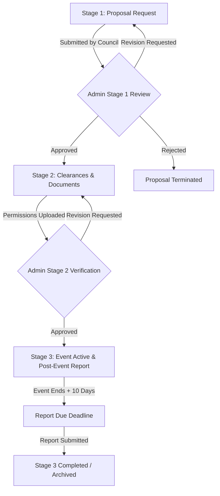

# 🎓 College Council Event Tracker (`CouncilTracker`)

> **Comprehensive 3-Stage Event Lifecycle & Approval Management System for Colleges and Universities.**
> Built with **React 19**, **Vite**, **Tailwind CSS v4**, **Firebase Auth & Firestore**, and **Cloudinary**.

---

## 🌟 Overview

`CouncilTracker` streamlines event management for campus student councils, departmental chapters, technical clubs, and university authorities (e.g., Dean / DOSW / Principal). It governs event proposals through a structured **3-Stage Lifecycle**, ensuring clear accountability, real-time stage tracking, document validation, venue collision prevention, and timely post-event reporting.

---

## 🔄 3-Stage Event Progression Flow



### **1. Stage 1: Proposal Review**
- Council fills in event details (Title, Dates, Category, Venue, Logistics, Budget, Expected Footfall, Contacts).
- Uploads the initial **Proposal Summary PDF**.
- **Admin Review:** Admin approves the proposal or requests revisions.

### **2. Stage 2: Documents & Clearance Uploads**
- Once Stage 1 is approved, the Council uploads mandatory clearance documents:
  - DOSW Permission Letter (PDF)
  - Council Approval Letter (PDF)
  - Venue Booking Slip (PDF)
  - Attendance Waiver (PDF, if applicable)
- **Admin Review:** Admin verifies all letters and approves final permissions.

### **3. Stage 3: Event Execution & Reporting**
- Event becomes fully approved and scheduled on the campus public calendar.
- Automatic **10-Day Countdown** starts for Post-Event Summary Report submission.
- Council submits the post-event summary PDF and photo gallery.
- Event is closed and permanently archived in the registry.

---

## ✨ Key Features

- 📅 **Public Interactive Landing Page:** Glassmorphic event showcase with an interactive multi-view calendar (Month/Week/Day/Agenda) using `react-big-calendar`.
- 🔐 **Council-Specific Portal:** Authenticated login mapped strictly to council emails (e.g., `frcrce.stuco@gmail.com`).
- 🛠️ **Administrative Control Panel:** Secure passcode-gated admin control center with dynamic stats, venue conflict detection, batch actions, and CSV data exports.
- ⚡ **Real-Time Synchronisation:** Live reactive state updates powered by Firebase Firestore snapshot listeners.
- ☁️ **Cloud Storage Integration:** PDF documents and photo galleries stored seamlessly via Cloudinary asset management.
- 📧 **Automated Notifications:** EmailJS integration for event status changes and reminder alerts.

---

## 🛠️ Tech Stack & Architecture

| Layer | Technology |
| :--- | :--- |
| **Frontend Framework** | React 19 + Vite |
| **Styling** | Vanilla Tailwind CSS v4 + Brutalism / Glassmorphism Design System |
| **Fonts** | Anton (Headings) & Satoshi (Body & Data UI) |
| **Database & Realtime Data** | Google Firebase Firestore |
| **Authentication** | Firebase Authentication (Email & Password) |
| **Media & File Storage** | Cloudinary REST API |
| **Calendar Engine** | React Big Calendar + `date-fns` |
| **Notifications** | EmailJS |
| **Linting & Code Quality** | Oxlint |

---

## 🚀 Getting Started

### 1. Prerequisites

- **Node.js**: `v18.0.0` or higher
- **Package Manager**: `npm` (included with Node.js)

### 2. Installation

```bash
# Clone the repository
git clone https://github.com/Soah1312/Council-Tracker.git
cd Council-Tracker

# Install dependencies
npm install
```

### 3. Environment Variables Setup

Create a `.env` file in the project root directory (copy from `.env.example`):

```bash
cp .env.example .env
```

Fill in your service configuration keys in `.env`:

```env
# Firebase Configuration
VITE_FIREBASE_API_KEY=your-api-key
VITE_FIREBASE_AUTH_DOMAIN=your-project-id.firebaseapp.com
VITE_FIREBASE_PROJECT_ID=your-project-id
VITE_FIREBASE_STORAGE_BUCKET=your-project-id.appspot.com
VITE_FIREBASE_MESSAGING_SENDER_ID=your-sender-id
VITE_FIREBASE_APP_ID=your-app-id
VITE_FIREBASE_MEASUREMENT_ID=your-measurement-id

# Cloudinary Configuration
VITE_CLOUDINARY_CLOUD_NAME=your-cloud-name
VITE_CLOUDINARY_UPLOAD_PRESET=your-unsigned-upload-preset

# Admin Passcode
VITE_ADMIN_PASSCODE=admin123

# EmailJS (Optional)
VITE_EMAILJS_SERVICE_ID=your-service-id
VITE_EMAILJS_TEMPLATE_ID=your-template-id
VITE_EMAILJS_PUBLIC_KEY=your-public-key
```

### 4. Running Locally

```bash
# Start Vite development server
npm run dev
```

The application will run locally at `http://localhost:5173`.

---

## 📦 Building for Production

To compile optimized static assets for deployment:

```bash
# Build the production bundle
npm run build

# Preview the build locally
npm run preview
```

The compiled output will be generated inside the `/dist` directory.

---

## 🛡️ Deployment & Hosting

### Deploying to Vercel / Netlify

1. Link your GitHub repository to Vercel or Netlify.
2. Set the build parameters:
   - **Build Command:** `npm run build`
   - **Output Directory:** `dist`
3. Add all environment variables from your `.env` file into the platform settings.
4. Set up single-page app (SPA) rewrites to redirect all routes (`/*`) to `/index.html`.

---

## 🔒 Security & Rules Summary

- **Firestore Rules (`firestore.rules`):** Protects event document modifications while allowing public reads for the calendar. Prevents unauthorized deletions.
- **Storage Rules (`storage.rules`):** Enforces 10MB maximum file payload limits and validates MIME types (PDFs and standard image formats only).

---

## 📄 License

Distributed under the MIT License. See `LICENSE` for more information.
